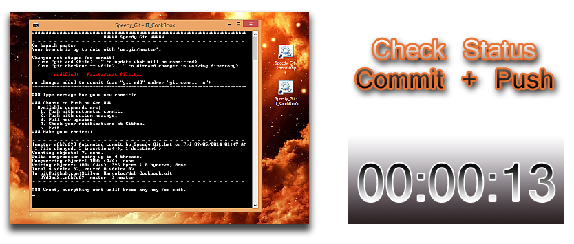
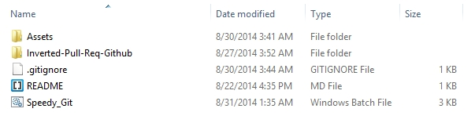
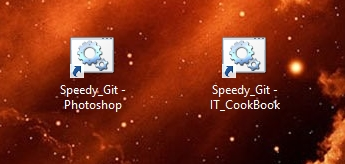

Speedy Git
==========

### Speed optimisation tool for custom Github workflow.

You might be interested with this script, if you work with Git / Github for Windows desktop application. It can be used with Windows 8.1 / 7 desktop environments. The set-up process it's not very long and you can do a lot customisations, in order to fit different types of cases.

#### It runs git commands in a row, when you just type "1/2/3" and then hit "Enter".

<a href="https://raw.githubusercontent.com/NIO-Design/Batch-Scripts/master/Speedy-Git/Assets/speedy_ssh_full.jpg" target="_blank">
</a>

#### Advantages:

-  :star: Instant access to the repo's path and no need to navigate.

-  :star: Skip regular input and set-up your own commands.

-  :sparkles: Save time with command for commit with message based by template. That's right - forget about the efforts to fix issues, inflicted by omitted "" around the text!

-  :sunny: Perfect utility for personal projects and repos handled by yourself.

-  :hourglass_flowing_sand: You don't need to launch the desktop app for simple tasks.

-  :books: It can be expanded with more options.

#### Disadvantages:

-  :maple_leaf: It is not full featured replacement for Github! You must clone your repos, add SSH keys and fix __complicated issues__ in the regular way!

-  :maple_leaf: If you use it with __"Github for Windows"__, you must enter your account credentials after the push command. (http style) I'll include one work-around latter in the article.

-  :gun: Not suitable in __big projects__ without improvements, refactoring and really __careful usage!__


#### Installation Process:

:sunny: Check if Git is added to your Win 8.1 / 7 Path.

  * Run the Command Prompt and type:

```
git --version
```
  * You must see something like this in the output: __git version 1.9.4.msysgit.0__

:sunny: Add bat exception into your __.gitignore__ file.
  * Open the .gitignore file into your repo's root directory and add the followed text:  
```
# Scripts #
###########
*.bat
```

:sunny: Place the script file into the same __root__ repo __directory__ on your PC. Just download the RAW version of "Speedy_Git.bat" into your desktop and then Copy & Paste.

  * If you want to use the script on __different__ repos - __repeat steps 2, 3 and 4__ for every single one of them. :point_left:
    In my case I'll repeat the process two times.
  
:sunny: Right click on the Speedy_Get.bat and make icon for the Desktop. Now rename the __desktop icon__ with proper name, accommodated to your repo's name.
  * Important step - in my workflow the .bat file represent your repository.
  * 

:sunny: Finally, what we have in total:
  * Two (or more) .bat files placed on different roots.
  * New shortcuts on the desktop.
  * Updated .gitignore files.

##### Update someone of your repos and then use the new shortcuts. :octocat:
